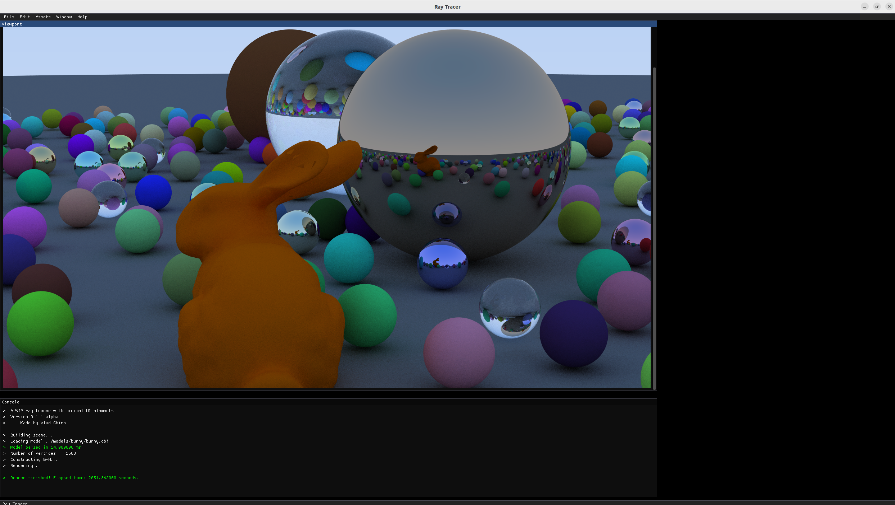

# Ray Tracer

Sample Render

A very simple WIP hobby CPU ray tracer with minimal UI elements.   
  
Heavily based on *Ray Tracing In One Weekend*, *Ray Tracing from the ground up*, *PBRT* 

## Features (WIP)
- Multiple tracers: Ray Cast, Whitted Ray Tracing, Brute force Path Tracing
- Material support: Matte, Phong, Emmisive, Specular

## External dependencies
- Dear ImGui + OpenGL 3 backend - for immediate mode GUI elements
- spng + miniz - for PNG encoding and decoding

## Notes
*TODO*
## Roadmap
*TODO*
## References
- [_Ray Tracing in One Weekend_](https://raytracing.github.io/books/RayTracingInOneWeekend.html), Peter Shirley. 2020
- Ray Tracing from the Ground Up, Kevin Suffern. 2007. 