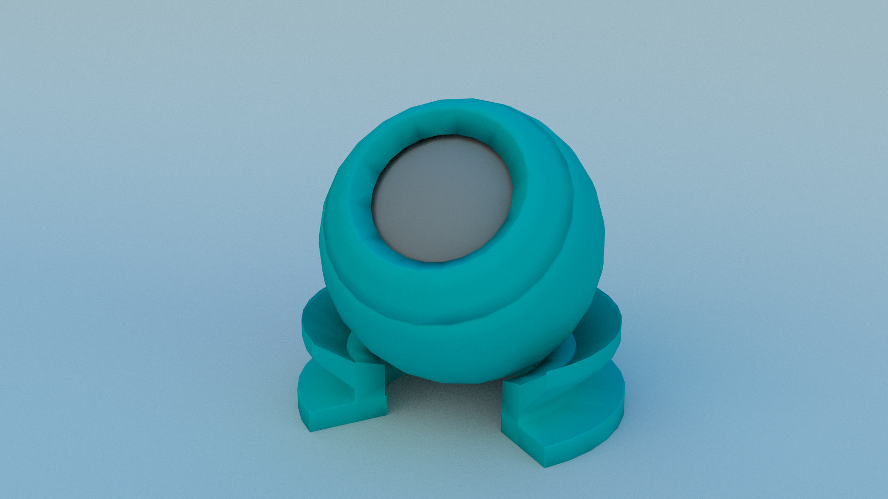
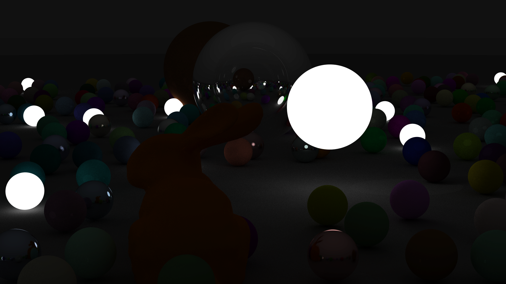
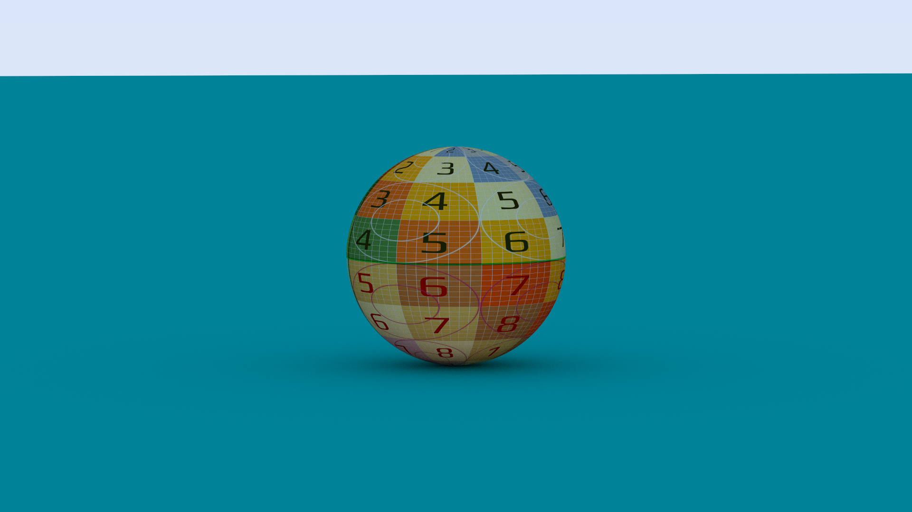

# Ray Tracer

Sample Render

A very simple WIP hobby CPU ray tracer with minimal GUI elements.   
  
Heavily based on *Ray Tracing In One Weekend*, *Ray Tracing from the ground up*, *PBRT* 

## Features (WIP)
- Multiple integrators: Path Tracing, Direct Illumination
- Materials: Matte, Reflective, Transparent, Emissive
- Lights: Directional, Point, Area
- 3D meshes in .obj format
- BVH Optimization
- Multithreaded rendering
- GUI

## External dependencies
- [Dear ImGui](https://github.com/ocornut/imgui) + OpenGL 3 backend - for immediate mode GUI elements
- [Eigen](https://eigen.tuxfamily.org/index.php?title=Main_Page) math library for linear algebra, affine transformations and other geometry utilities
- [spng](https://github.com/randy408/libspng/) + [miniz](https://github.com/richgel999/miniz) - for PNG encoding and decoding
- [tinyobjloader](https://github.com/tinyobjloader/tinyobjloader) for 3D meshes 

## Notes
*TODO*
## Roadmap
- ~~3D Meshes~~
- ~~Affine transformations~~
- Multiple Importance Sampling
- Textures
- Environment Light
- Fresnel dielectrics and conductors
- Oren-Nayar diffuse model
- Optimize BVH and add Surface Area Heuristic
- Efficient bucket rendering
- Bidirectional path tracing
- Disney BSDF
- glTF scene description format

## Gallery

Modified Cornell Box showcasing affine transformations, lambertian diffuse, perfect specular reflection and simple transparency

The Mori Knob (© Yasutoshi Mori) with lambertian diffuse material

Ray tracing in One Weekend cover render with Stanford bunny and spherical area lights

A simple sphere with a diffuse, spherical mapped UV test texture

## References
- [_Ray Tracing in One Weekend_](https://raytracing.github.io/books/RayTracingInOneWeekend.html), Peter Shirley. 2020
- Ray Tracing from the Ground Up, Kevin Suffern. 2007. 

- Matt Pharr, Wenzel Jakob & Greg Humphreys (2016). Physically Based Rendering: From Theory to Implementation (3rd ed.). Morgan Kaufmann Publishers Inc.

